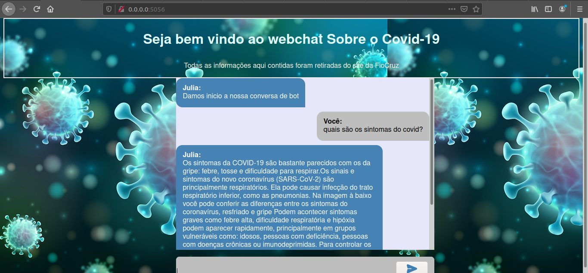

# Teste Técnico Compasso - Bot Covid-19

  #### Sobre:
Neste projeto foi desenvolvido um chatbot utilizando o framework [RASA](https://rasa.com/docs/rasa/). O objetivo foi reproduzir o faq existente no site da [FioCruz](https://mooc.campusvirtual.fiocruz.br/rea/coronavirus/faq.html) contemplando as abas "Geral" e "Da população".
Além do Rasa foram utilizados os seguintes componentes:
  - Flask
  - Docker
  - Ngrok
  - Flask-cors
  - CSS

Para coletar as perguntas de uma maneira mais simples foi implementando um script utilizando o google colab, o mesmo pode ser facilmente adaptado para que as perguntas de qualquer uma das abas do faq possam ser capturadas, o código pode ser conferido no arquivo [fiocruz.ipynb](https://github.com/gabselbach/ChatBotCovid-19/blob/main/fiocruz.ipynb)

Foi desenvolvido para ser disponibilizado o chatbot projetado uma versão de web e também uma versão para o telegram.

#### Começando:
Clone o projeto para o seu computador

#### Como Rodar:
> Você precisa ter o docker instalado o executar mais facilmente o bot.

No projeto temos a seguinte estruturada de pastas:

>  projeto_rasa\
----bot\
----static\
----templates\
----app.py
----docker-compose.yml
----Dockerfile
----engine_start.sh
----ngrok
----requirements.txt

Vamos iniciar executando o docker

```sh
$ docker-compose up 
```

Se tudo der certo será instalado:
* python3
* flask
* rasa
* flask-cors


Se por acaso algo não for instalado você pode instalar manualmente segue os links para instalação:
* [Python3](https://www.python.org/downloads/)
* [Flask](https://flask.palletsprojects.com/en/1.1.x/installation/)
* [Rasa](https://rasa.com/docs/rasa/installation/)
* [Flak-cors](https://flask-cors.readthedocs.io/en/latest/)

Caso você precise fazer a instalação manual recomendo que utilize um ambiente virtual para isso. Faça a instalação normal do python e depois dentro na pasta que contem os arquivos execute:

```
$ python3 -m venv venv 
```
Windows:

```
 py -3 -m venv venv
```
Este comando irá criar um ambiente virtual e uma pasta venv/ onde será armazenado tudo que você baixar. Para acessar o ambiente digite no terminal:

```
. venv/bin/activate
```
Windows
```
venv\Scripts\activate
```

Ao executar o comando, sera iniciado o server do rasa e também iniciado a aplicação do flask:
```
$ chmod +x engine_start.sh
```
Para ver o bot sendo executado no navegador acesse:
```
http://0.0.0.0:5056/
```

Ambiente Web:



Você poderá conversar com o bot. Caso queria iniciar o bot no terminal execute dentro da pasta bot/
```
$ rasa shell
```

Dentro da pasta bot/models/ existe o último modelo que foi treinado, caso você faça alguma alteração no código ou queira treinar o modelo novamente execute no terminal

```
$ 
rasa train
```
Caso você não consiga executar o arquivo engine_start ou não queira, para rodar o server do rasa bot execute:

```
$ rasa run -m bot/models -p 5005 --enable-api --cors “”rasa run -m models --enable-api --cors “”
```

E para rodar o ambiente web execute:

```
$ python3 app.py
```

Isso irá levantar o ambiente local que pode ser acessado pelo navegador no endereço que coloquei anteriormente.

##### Telegram:
Para utilizar o telegram será necessário fazer algumas configurações. Primeiro o bot no telegram obriga que tenhamos um conexão https, para simular esse tipo de  conexão em ambiente local recomendo utilizar o [ngrok](https://dashboard.ngrok.com/get-started/setup) . Já existe o arquivo na pasta, mas você precisa realizar a autenticação, como o site explica.
Depois de realiza a autenticação você pode executar no seu terminal:

```
./ngrok http 5005
```
Este comando irá fazer simular uma conexão https da porta 5005, na qual estamos rodando o servidor do rasa.

O ngrok começará a ser executado no terminal e você conseguirá observar uma linha parecida com essa:

```
https://e01a81c83cad.ngrok.io ->  http://localhost:5005/

```

dentro da pasta bot/ no arquivo credentials.yml:
você deve editar a variavel [webhook_url] com o link que o https do ngrok,substitua todo o link existente no arquivo antes de "/webhooks/telegram/webhook"

Por fim para utilizar o bot no telegram, basta acessá-lo [AQUI](http://t.me/CovidCompas_bot)


O bot em funcionamento:

